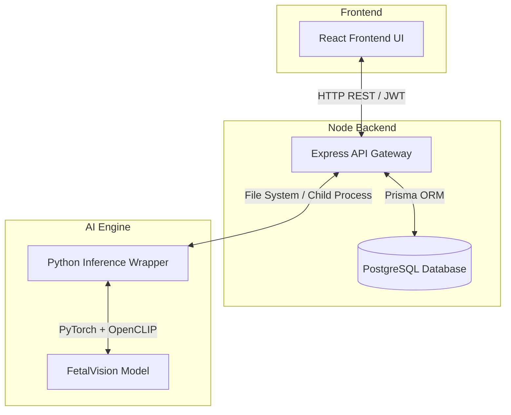

# 👶 FetalVision AI: Maternal-Fetal Ultrasound Platform

FetalVision AI is an end-to-end, production-ready medical web application powered by the state-of-the-art **FetalCLIP** vision-language foundation model. It empowers maternal-fetal medicine specialists to instantly analyze ultrasound imagery with zero-shot capabilities, providing precise predictions, confidence scores, and interpretable heatmaps (Class Activation Maps).

The platform features a highly modular, secure architecture consisting of a **React + Vanilla CSS** Frontend, a **Node.js/Express + PostgreSQL** Backend, and a **Python/PyTorch** Inference Engine.

---

## Table of Contents

- [Features](#features)
- [System Architecture](#system-architecture)
- [Tech Stack](#tech-stack)
- [Installation & Setup](#installation--setup)
- [Project Structure](#project-structure)
- [Access URLs & Credentials](#access-urls--credentials)

---

## Features

### Doctor Dashboard & UI
- **Premium Medical SaaS Interface** — Glassmorphism, tailored blue/cyan gradients, and smooth responsiveness built completely with Vanilla CSS (No Tailwind).
- **Interactive Dashboard** — Real-time analytics, total predictions, accuracy monitoring, and dynamic charts (via Recharts).
- **History & Patient Tracking** — Searchable table logs of past ultrasound predictions and confidence intervals.
- **Internal Knowledge Base** — Comprehensive `About` page replacing external documentation for secure institutional deployment.

### Clinical Upload & AI Diagnosis
- **Drag-and-Drop Uploader** — Secure local processing of `.jpg`, `.png`, and `.dicom` ultrasound imagery up to 20MB.
- **Zero-Shot Diagnosis** — Uses pre-trained FetalCLIP weights to automatically identify fetal anomalies and structures.
- **Visual Interpretability** — Generates and displays side-by-side Class Activation Maps (CAM heatmaps) to highlight the regions the AI focused on.
- **Safe Fallback Mode** — Capable of running in a mocked-inference mode if the heavy multi-GB `FetalCLIP_weights.pt` file is not present locally, ensuring the UI remains demonstrable.

### Security & Backend
- **Secure Authentication** — JWT-based authentication, bcrypt password hashing, and role-based access.
- **Robust API Gateway** — Configured with `helmet` for security headers, strict CORS, and Express Validator.
- **Data Persistence** — Robust relational schema mapped via Prisma ORM to PostgreSQL.

---

## System Architecture



---

## Tech Stack

- **Frontend:** React 19, Vite, Vanilla CSS3 (CSS Grid, Flexbox, Variables), Framer Motion, Recharts
- **Backend:** Node.js, Express.js, Prisma ORM, JSON Web Tokens (JWT), Multer
- **Database:** PostgreSQL (Containerized via Docker)
- **AI & ML:** Python 3, PyTorch, OpenCLIP, python-shell
- **Orchestration:** Concurrently (running both Frontend and Backend together)

---

## Installation & Setup

1. **Clone the repository and install dependencies:**
   ```bash
   cd FetalVisionAI
   npm install
   cd backend && npm install
   cd ../frontend && npm install
   cd ..
   ```

2. **Start the Database (PostgreSQL):**
   ```bash
   docker-compose up -d
   ```

3. **Initialize the Database Schema:**
   ```bash
   cd backend
   npx prisma generate
   npx prisma db push
   cd ..
   ```

4. **Add FetalCLIP Weights (Optional):**
   Place the downloaded `FetalCLIP_weights.pt` into the `python_ai/` directory. If omitted, the system will gracefully fall back to a mock diagnostic response.

5. **Start the Application:**
   Run the master launch script from the root folder:
   ```bash
   npm run dev
   ```

---

## Project Structure

```
FetalVisionAI/
├── backend/
│   ├── controllers/      # Route logic (Auth, Predict, History)
│   ├── middleware/       # JWT Auth verification
│   ├── prisma/           # Schema and Database migrations
│   ├── routes/           # Express API endpoints
│   ├── uploads/          # Locally stored ultrasound images & heatmaps
│   └── index.js          # Express server entry point
├── database/             # Postgres Docker data volumes
├── frontend/
│   ├── src/
│   │   ├── layouts/      # Main application frame and sidebar
│   │   ├── pages/        # Dashboard, Upload, History, Login, About
│   │   └── styles/       # Modular Vanilla CSS (global.css, auth.css, etc.)
│   └── vite.config.js    # Vite builder configuration
├── python_ai/
│   └── inference.py      # Python bridge for FetalCLIP model execution
├── docker-compose.yml    # Postgres container configuration
└── package.json          # Root concurrency script
```

---

## Access URLs & Credentials

Once running via `npm run dev`, you can access the platform at:

- **Frontend Application:** `http://localhost:5173`
- **Backend API Gateway:** `http://localhost:5000`

**To test the platform:**
1. Navigate to the frontend URL.
2. Click **Get Started** or **Create an Account**.
3. Register a new Doctor profile.
4. Log in and navigate to the **Analyze Image** tab to test the AI pipeline.
